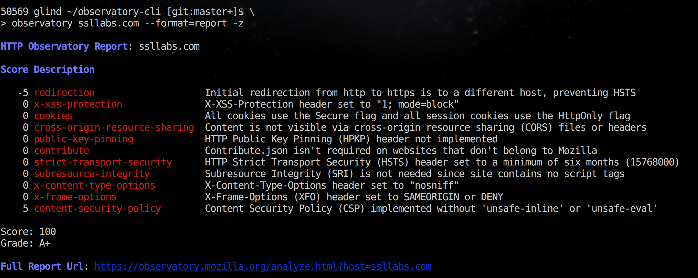

# Observatory by Mozilla CLI Client

## Score your site on its HTTPS practices

Observatory by Mozilla is a project designed to help developers, system administrators, and security professionals configure their sites safely and securely.

## See Observatory in Action!

- <https://observatory.mozilla.org/>
- [FAQ](https://observatory.mozilla.org/faq.html)

### Example site report, with additional options



The [full report url](https://observatory.mozilla.org/analyze.html?host=ssllabs.com) has suggestions to **repair** each of these issues.


## Install

```
$ npm install -g observatory-cli
```

(There is also a `Dockerfile` for use with `docker-compose`)

## Usage

1.  **Scan a site** for `https` best practices.

    ```
    # json!
    $ observatory some.site.name

    # include 'zero' scores, display as a tabular report
    $ observatory some.site.name --zero --format=report

    # attempt to force a re-scan
    $ observatory some.site.name --rescan

    ```

2.  **Test a site** as part of a Continuous Integration pipeline.

    Script will FAIL unless the grade is AT LEAST `B+`

    ```
    $ observatory some.site.name --min-grade B+
    ```

    ...and the score is at least 50.

    ```
    $ observatory some.site.name --min-grade B+ --min-score 50
    ```


3.  **Show the URL** for the web report.

    ```
    $ observatory some.site.name --format=url
    ```

4.  **nagios** monitoring plugin mode.

    For `--nagios <failcode>`, `failcode` will be the exit code if the test fails.

    `--min-score`, `--min-grade`, `--zero`, `--skip` aftect the test.

    ```
    $ observatory  --nagios 2 --min-score 85 -z --skip cookies
    CRITICAL ["content-security-policy",...,"x-xss-protection"]
    ```

    If neither `--min-score` nor `--min-grade` is specified, any
    negative scores fail the test.

    ```
    # '2' means 'critical.'  Exits '2'

    $ observatory ssllabs.com --nagios 2
    CRITICAL ["redirection"]
    ```

    We can `--skip` the failing rule, and affect the score.

    ```
    $ observatory ssllabs.com --nagios     2 --skip redirection
    observatory [INFO] modfiying score, because of --skip.  was: 100, now: 105
    OK
    ```

    Quiet output with `-q`.

    ```
    $ observatory ssllabs.com --nagios     2 --skip redirection -q
    OK
    ```

## Help

```
$ observatory --help

  Usage: index [options] <site>

  cli for interacting with Mozilla HTTP Observatory

  https://observatory.mozilla.org/

  Options:

    -h, --help               output usage information
    -V, --version            output the version number
    --format [format]        format for output.  choice:  (json|report|csv|url).  `json` is default
    --min-grade <grade>      testing: this grade or better, or exit(1)
    --min-score <score>      testing: this score or better, or exit(1)
    --nagios [failcode]      nagios mode, exits with [failcode] on failure
    --rescan                 initiate a rescan instead of showing recent scan results
    -z, --zero               show test results that don't affect the final score
    --attempts <n>           number of attempts to try before failing
    --api-version [version]  api version:  defaults to 1
    --skip <rule>            skip rules by name.  works with min-score only
    --tls                    do tls checks instead
    -q, --quiet              turns off all logging


Formats help:
    - json    json of the report
    - report  plain-text tabular format
    - csv     alias for report
    - url     url for online version


Nagios Mode (--nagios)
  - if `--min-score` and/or `--min-grade`, use those.
  - else *any* failing rules fail the check.
  - exits with integer `failcode`.
```


## Example Report, Text Version

Report, with options:

* `-z` to show '0' rules (all rules)
* `--skip` to skip a rule (affecting SCORE, but not GRADE)

```
$ observatory some.site --format=report -z --skip redirection

observatory [INFO] modfiying score, because of --skip.  was: 60, now: 65

HTTP Observatory Report: some.site

Score Description

  -20 content-security-policy        Content Security Policy (CSP) implemented, but allows 'unsafe-inline' inside script-src
  -10 x-xss-protection               X-XSS-Protection header not implemented
   -5 x-content-type-options         X-Content-Type-Options header not implemented
    0 contribute                     Contribute.json implemented with the required contact information
    0 cookies                        No cookies detected
    0 cross-origin-resource-sharing  Content is not visible via cross-origin resource sharing (CORS) files or headers
    0 public-key-pinning             HTTP Public Key Pinning (HPKP) header not implemented
    0 strict-transport-security      HTTP Strict Transport Security (HSTS) header set to a minimum of six months (15768000)
    0 subresource-integrity          Subresource Integrity (SRI) not implemented, but all scripts are loaded from a similar origin
    0 x-frame-options                X-Frame-Options (XFO) header set to SAMEORIGIN or DENY

Score: 65 (modified due to --skip)
Grade: C+

Full Report Url: https://observatory.mozilla.org/analyze.html?host=some.site

```

## Related projects

- [HTTP Observatory](https://github.com/mozilla/http-observatory) by April King
- [Python observatory-cli](https://github.com/mozilla/http-observatory-cli) by April King


## Technical / Development

### Debug urls

```
NODE_DEBUG=request observatory --format report --rescan --zero www.mozilla.org
```

### API Documentation

https://github.com/mozilla/http-observatory/blob/master/httpobs/docs/api.md
